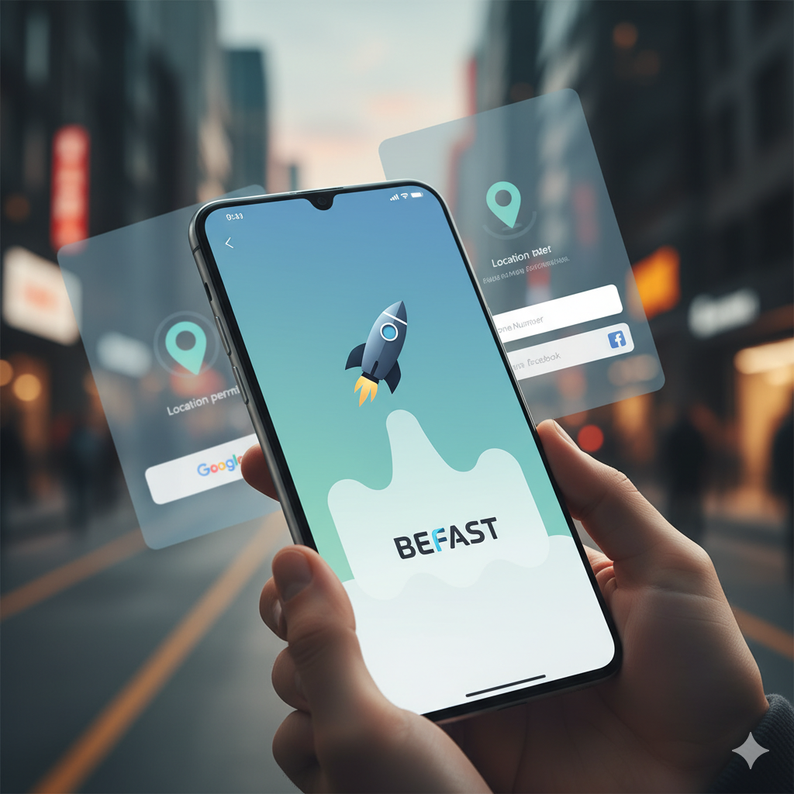
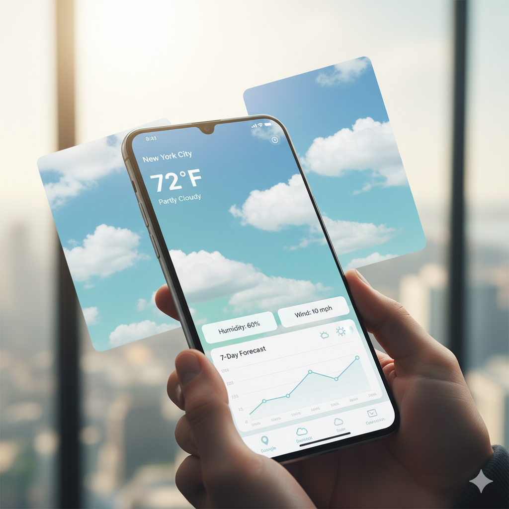
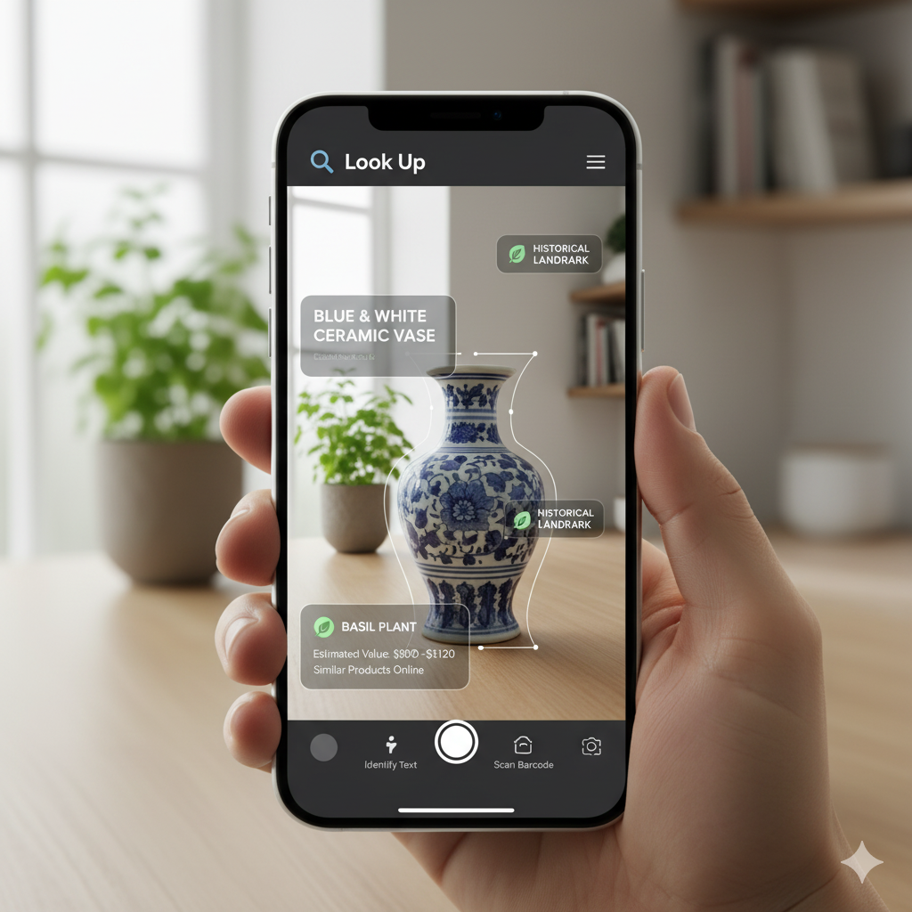

# 🚀 Mohammed Harun — 3D Portfolio

Personal portfolio showcasing Android, AI/ML, and full‑stack projects with 3D interactions, smooth animations, and a clean UI.

## Preview





## Features

- **3D interactions**: Spline scene with animated keyboard and keycaps
- **Motion**: GSAP + Framer Motion for smooth reveals and hovers
- **Responsive**: Looks great on mobile and desktop
- **Projects grid**: Image modals and descriptions
- **Contact**: Email via Resend API

## Tech Stack

- **Frontend**: Next.js, React, Tailwind CSS, shadcn/ui, Aceternity UI
- **Animation**: GSAP, Framer Motion, Spline Runtime
- **Other**: Resend, Socket.io, Zod

## Getting Started

### Prerequisites

- Node.js 18+
- npm

### Install & Run

```bash
git clone https://github.com/SAKMOTO/portfolio.git
cd portfolio
npm install
npm run dev
# open http://localhost:3000
```

## Environment

Create `.env.local` and add:

```bash
RESEND_API_KEY=your_resend_key
```

The contact form uses `src/app/api/send/route.ts` and sends to the email in `src/data/config.ts`.

## Deploy

### Vercel (recommended)
- Import the repo in Vercel
- Add env var `RESEND_API_KEY`
- Deploy

### Netlify
- Build: `next build`
- Publish: `.next`
- Add env var `RESEND_API_KEY`
    npm run dev
    # or
    yarn dev
    ```

5. Open [http://localhost:3000](http://localhost:3000) in your browser to see the magic!

## 🚀 Deployment

This site is deployed on Vercel. For your own deployment, follow these steps:

1. Push your code to a GitHub repository.
2. Connect your repository to Vercel.
3. Vercel will handle the deployment process.

## 🤝 Contributing

If you'd like to contribute or suggest improvements, feel free to open an issue or submit a pull request. All contributions are welcome!

## 📄 License

This project is open source and available under the [MIT License](LICENSE).
